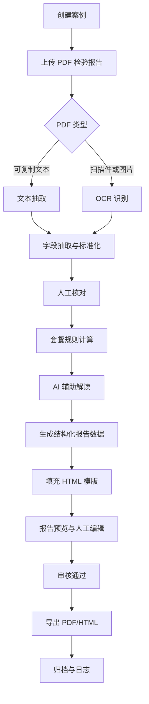

# AWK-report-gnyx 开发文档

版本：V0.3  
日期：2026-06-03  
项目代号：AWK-report-gnyx  
当前试点套餐：P02 - 肠道功能综合评估健康管理报告  
当前 P02 模版路径：`C:\Users\Administrator\Desktop\AWK-OCR\figma-plugin-figma-openai-curated-1\outputs\html-report\P02\`

## 0. 已确认决策

1. P02 最终名称确定为“肠道功能综合评估健康管理报告”。
2. P02 存在真实或脱敏 PDF 样例，样例路径为 `C:\Users\Administrator\Desktop\AWK-OCR\功能医学检测报告模板（2026.4.3）\P02-流程化\原始\`，后续用于 OCR、字段抽取、渲染和导出测试。
3. OCR 和 AI 均允许调用云端接口，V1 不强制离线部署。
4. AI 计划调用 DeepSeek V4；实际接入时通过配置管理 `base_url`、`api_key`、`model`、超时和重试策略。
5. P02 指标判定规则和参考范围先由 AI 生成初版，再由平台内人工调整、审核和发布。
6. P02 已作为首个试点套餐跑通主流程；P03 已完成一轮流程研发与测试，当前进入 P01 套餐研发，其他套餐暂时保留占位配置。
7. P02 样例 PDF 允许复制到项目测试目录，当前已复制到 `packages/P02/tests/samples/`。
8. 开发阶段禁止占用端口 `5173` 和 `8000-8010`，避免影响现有 Python 服务。
9. 软件需要预留局域网多人协作能力，支持报告单人工审查流程。
10. SQLite 数据库需要具备加密、备份、恢复机制。
11. OCR 和 DeepSeek API Key 放在后台管理中，加密写入数据库供系统调用，不以明文写入配置文件。
12. OCR、AI、导出任务需要异步队列和任务状态，支持批量导入、批量解析、批量 AI 生成报告，并通过进度条展示进度。
13. 已导出的历史报告必须锁定当时使用的规则版本、模版版本、提示词版本和生成结果快照。
14. PDF 最终导出页数不固定，不同套餐可输出不同页数；P02 当前以现有 10 页模版跑通。
15. 当前业务口径下，功能医学报告不要求在发送云 OCR/AI 前做客户隐私脱敏。
16. 当前版本预置 3 个角色：管理员、客服、检测。管理员具备全部权限；客服默认进入批量任务，具备上传 PDF、OCR 解析、AI 输出权限；检测具备报告审查权限。
17. 报告审查菜单中点击“输出 PDF”后，该报告默认为已审报告并锁定，后续不可继续编辑；如需修改，必须由管理员执行解审核后再编辑。
18. 报告生成平台必须具备账号管理体系，用户通过账号密码登录后才能进入平台生成报告；管理员可在“账号管理”菜单中新建账号、配置角色权限、启停账号和重置密码。
19. 开发初始化时如数据库中没有账号，系统自动创建默认管理员账号 `admin`，初始密码 `Awk@2026!`；正式部署或试运行前必须修改默认密码。
20. P03 套餐名称确定为“P03-糖脂代谢综合评估健康管理报告”，报告流程已完成一轮研发和测试。
21. P01 套餐名称确定为“深度肠道健康管理评估报告”，模板来源路径为 `C:\Users\Administrator\Desktop\AWK-OCR\figma-plugin-figma-openai-curated-1\outputs\html-report\P01`。
22. P01 当前先完成套餐配置、模板工程化、基础 OCR/AI/渲染链路接入；专项菌群指标 OCR 规则需在拿到 P01 真实或脱敏 PDF 样例后继续升级。
23. P04 套餐名称确定为“营养素状态评估健康管理报告”，模板来源路径为 `C:\Users\Administrator\Desktop\AWK-OCR\figma-plugin-figma-openai-curated-1\outputs\html-report\P04`。
24. P08 套餐名称确定为“心血管代谢风险评估健康管理报告”，模板来源路径为 `C:\Users\Administrator\Desktop\AWK-OCR\figma-plugin-figma-openai-curated-1\outputs\html-report\P08`；当前已完成模板工程化、基础 OCR/AI/渲染链路接入，并基于 `hebing22757.pdf` 完整 OCR JSON 将策略升级为 `P08-ocr-strategy-v0.2-professional-json-adapter`，支持 `report_info + pages[].test_items` 专业结构化输入。
25. P09 套餐名称确定为“女性激素平衡评估健康管理报告”，模板来源路径为 `C:\Users\Administrator\Desktop\AWK-OCR\figma-plugin-figma-openai-curated-1\outputs\html-report\P09`；当前已完成模板工程化、基础 OCR/AI/渲染链路接入，并基于 `hebing93044.pdf` 将 OCR 策略升级为 `P09-ocr-strategy-v0.2-structured-json-row-adapter`，支持 report_info + pages[].test_items JSON 输入和单位前置 PDF 文本层行解析，核心覆盖 E2、LH、FSH、孕酮、睾酮、SHBG、AMH、泌乳素和总IgE，皮质醇保留为可选项目；后续又将第02-06页模板、字段、规则与提示词升级到 `P09-html-v0.2-data-bound-layout`、`P09-fields-v0.3-ai-binding-layout`、`P09-rules-v0.2-ai-binding-layout`、`P09-prompts-v0.2-a4-bound`，补齐 AI 内容绑定并压缩版面文案到 A4 单页。

26. P11 套餐名称确定为“食物敏感/免疫相关评估健康管理报告”，当前已基于食物不耐受完整 42 项 `reportMeta + foodIntoleranceResults` OCR JSON 将策略升级为 `P11-ocr-strategy-v0.4-food-intolerance-42-adapter`，同时兼容 `hebing34322.pdf` 对应的 `reportMeta + sections[].results + foodAppendix` 综合 JSON，核心覆盖 IgG1-IgG4、总IgE 和食物不耐受检测结果，并保留 PDF 文本层回退解析。

## 1. 项目背景

AWK-report-gnyx 是一款面向健康管理业务的检验报告解读与健康管理报告生成软件。系统通过 OCR 识别普通检验 PDF 报告单，抽取并结构化检验项目、结果、单位、参考范围、异常标记等内容，再结合规则库和 AI 生成健康管理解读，最后将内容自动填充到指定 HTML 报告模版中，导出完整健康管理报告。

当前规划包含 17 个套餐项目。P02 是首个试点套餐，目标是先跑通从 PDF 导入、OCR 识别、AI 辅助解读、模版填充、人工复核到报告导出的完整闭环。其他套餐先以占位方式保留编码和配置入口，待 P02 流程稳定后再逐项研发和测试。

## 2. 产品目标

1. 降低健康管理师手工整理检验报告和撰写报告的工作量。
2. 将不同机构、不同版式的 PDF 检验报告统一抽取为标准结构化数据。
3. 基于套餐配置和医学知识规则生成一致、可追溯、可复核的健康管理解读。
4. 通过 HTML 模版生成品牌统一、版式稳定、可导出的完整健康管理报告。
5. 支持 17 个套餐在同一个软件壳内管理，套餐之间通过配置、规则、模版隔离。

## 3. MVP 范围

P02 MVP 只解决一条完整主流程：

1. 创建客户或报告案例。
2. 上传普通检验 PDF 报告单。
3. 识别 PDF 文本或图片内容。
4. 抽取 P02 所需检验项目和客户基础信息。
5. 人工核对 OCR 与字段抽取结果。
6. 生成 P02 结构化健康解读。
7. 将内容填充到 P02 HTML 模版。
8. 预览并允许健康管理师人工修改。
9. 导出 PDF 或 HTML 报告包。
10. 保存报告数据、导出文件、操作记录。

MVP 暂不追求一次性覆盖全部 17 个套餐，也不把 AI 输出作为临床诊断结论。AI 内容定位为健康管理辅助解读，所有报告导出前必须经过人工复核。

## 4. 用户角色

| 角色 | 主要职责 |
| --- | --- |
| 管理员 | 具备全部权限，维护套餐配置、后台凭据、用户权限、备份恢复、报告审查、PDF 导出和解审核 |
| 客服 | 默认进入批量任务，负责上传 PDF、发起 OCR 解析任务、发起 AI 输出任务 |
| 检测 | 负责报告审查、编辑待审报告内容、输出 PDF；输出 PDF 后报告自动进入已审锁定状态 |

账号体系要求：

1. 所有业务页面必须登录后才能访问。
2. 前端不允许通过手动切换角色获得权限，当前角色必须来自后端登录账号。
3. 密码不得明文保存，当前实现使用 PBKDF2-SHA256 加盐哈希入库。
4. 登录后由后端发放会话 token，接口通过 `Authorization: Bearer <token>` 识别当前用户。
5. 停用账号后，该账号的未过期会话应立即失效。

## 5. 总体业务流程



## 6. 软件模块

| 模块 | 说明 |
| --- | --- |
| 案例管理 | 维护客户、样本、套餐、报告状态、历史报告 |
| 文档导入 | 支持 PDF、图片导入，保留原始文件 |
| OCR 引擎 | 识别扫描件、图片型 PDF、表格和检验项目文本 |
| 字段抽取 | 将 OCR 文本转为结构化检验数据 |
| 标准化字典 | 统一项目名称、别名、单位、结果状态、参考范围 |
| 套餐引擎 | 根据套餐配置决定需要哪些指标、规则和模版 |
| 规则引擎 | 先用确定性规则判断阴性、阳性、升高、降低、风险等级 |
| AI 解读 | 基于结构化数据生成健康管理摘要、建议和解释 |
| 模版渲染 | 将结构化数据填充到 HTML 模版 |
| 报告编辑 | 支持人工修改、保存草稿、版本记录 |
| 导出服务 | 导出 PDF、HTML 包，必要时生成图片预览 |
| 审核与日志 | 记录 OCR 修正、AI 生成、人工修改、导出行为 |
| 套餐配置中心 | 管理 17 个套餐的字段、规则、提示词、模版版本 |

## 7. 推荐技术架构

当前模版路径和文件结构更接近本地 Windows 研发环境，推荐 V1 采用本地优先架构，同时允许接入云端 OCR 和云端 AI 服务。后续可扩展为局域网或云端部署。

### 7.1 前端壳

推荐：Electron + React + TypeScript + Vite。若后续需要更轻量的安装包，可评估 Tauri。

核心能力：

1. 本地文件选择、拖拽上传、预览。
2. 案例列表、报告状态流转。
3. OCR 结果校对表格。
4. AI 解读审核面板。
5. HTML 报告预览和可编辑区域。
6. 导出 PDF、打开报告目录。

### 7.2 后端服务

推荐：Python FastAPI。Node.js 可用于前端构建、Electron 主进程和辅助脚本，但 OCR 后处理、AI 结构化、PDF/表格解析和规则引擎优先放在 Python 服务内。

核心能力：

1. 文件存储与路径管理。
2. PDF 文本抽取和图片渲染。
3. OCR 调用。
4. 字段抽取与规则计算。
5. AI 模型调用与 JSON 校验。
6. HTML 模版渲染。
7. Playwright 或 Chromium PDF 导出。
8. 数据库读写和审计日志。

### 7.3 开发工具与端口约束

推荐开发工具：

1. VS Code / Cursor / Codex：代码编写、调试、AI 协作。
2. Git：版本管理。
3. Node.js + pnpm：Electron、React、Vite 前端工程。
4. Python 3.11+：FastAPI、OCR 后处理、AI 数据清洗、规则引擎。
5. SQLite：P02 MVP 本地数据存储。
6. Playwright / Chromium：HTML 预览、截图测试、PDF 导出。

开发阶段端口约束：

| 端口 | 状态 | 说明 |
| --- | --- | --- |
| `5173` | 禁止占用 | 用户已有服务或保留端口，前端 Vite 不使用默认端口 |
| `8000-8010` | 禁止占用 | 用户已有 Python 服务范围，FastAPI 不使用这些端口 |
| `5188` | 推荐使用 | 前端 Vite / Electron Renderer 开发端口 |
| `8111` | 推荐使用 | AWK-report-gnyx FastAPI 主服务端口 |
| `8112` | 预留 | 报告渲染、导出或调试服务端口 |
| `8113` | 预留 | OCR worker、本地回调或异步任务调试端口 |

开发要求：

1. Vite 配置中显式设置 `server.port = 5188`，不要使用默认 `5173`。
2. FastAPI 本地启动命令显式指定 `--port 8111`，不要使用 `8000`。
3. 如果推荐端口被占用，选择 `8114` 及以上端口，并继续避开 `5173` 和 `8000-8010`。
4. 端口配置写入 `.env` 或配置文件，不要硬编码在业务模块里。

### 7.4 云端服务接入

V1 允许调用云端 OCR 和云端大模型接口，但软件内部需要做供应商抽象，避免把某个服务商写死在业务代码里。

推荐配置项：

```json
{
  "ocr_provider": {
    "name": "cloud-ocr",
    "base_url": "",
    "credential_ref": "credential:ocr:default",
    "credential_storage": "encrypted_database",
    "timeout_seconds": 60,
    "retry": 2
  },
  "ai_provider": {
    "name": "deepseek",
    "base_url": "",
    "credential_ref": "credential:ai:deepseek",
    "credential_storage": "encrypted_database",
    "model": "deepseek-v4",
    "timeout_seconds": 90,
    "retry": 2
  }
}
```

AI 模型名称以实际接口支持的 `model` 参数为准，平台后台管理页需要允许管理员调整。OCR 和 DeepSeek API Key 由后台录入，加密写入数据库；业务配置文件只保存凭据引用，不保存明文密钥。

### 7.5 数据库

V1 使用 SQLite，便于 P02 快速试点；同时预留局域网多人协作能力。局域网协作阶段推荐由一台主机运行 FastAPI 服务和 SQLite 数据库，其他客户端通过局域网访问后端服务，不直接访问数据库文件。若并发、权限或数据规模明显增加，后续可迁移到 PostgreSQL。

SQLite 要求：

1. 启用数据库加密，优先评估 SQLCipher 或等价加密方案。
2. API Key、服务密钥和后台配置不得明文写入 `.env`、JSON、YAML 等配置文件。
3. 敏感配置写入数据库前需要加密，主密钥由部署初始化流程、系统凭据管理或管理员口令保护。
4. 启用定期备份，支持手动备份和自动备份。
5. 支持从备份恢复，并记录恢复操作者、恢复时间和备份版本。
6. 建议启用 WAL 模式，降低多人协作时读写阻塞。

本地文件包括：

1. 原始 PDF。
2. OCR 中间结果。
3. 结构化 JSON。
4. 渲染后的 HTML 报告。
5. 导出的 PDF。
6. 审计日志。

### 7.6 局域网多人协作

软件第一版以本地桌面应用为主，但架构上需要预留局域网多人协作。

推荐模式：

1. 服务端模式：一台局域网主机运行 FastAPI、SQLite、文件存储、任务队列。
2. 客户端模式：多台电脑运行 Electron 客户端，通过局域网地址连接服务端。
3. 权限模式：用户登录后按角色访问案例、报告、规则、后台配置。
4. 审查模式：报告导出前必须经过人工审查；在报告审查菜单点击“输出 PDF”后，报告状态自动标记为已审并锁定。
5. 锁定模式：同一报告被编辑或审核时，需要显示当前操作者，避免多人覆盖。
6. 审计模式：上传、OCR、AI 生成、人工修改、审核、导出、恢复备份均写入日志。
7. 解审核模式：已审报告如需继续修改，只允许管理员先执行解审核，状态回到可编辑后再由审查人员调整。

### 7.7 异步任务与批处理

系统需要支持批量导入、批量解析、批量 AI 生成报告和批量导出，因此 OCR、AI、报告渲染和 PDF 导出都应按异步任务处理。

任务类型：

| 任务类型 | 说明 |
| --- | --- |
| `import_documents` | 批量导入 PDF 或图片 |
| `ocr_documents` | 批量 OCR 或文本抽取 |
| `extract_fields` | 批量结构化字段抽取 |
| `generate_ai_report` | 批量调用 DeepSeek 生成解读 |
| `render_html` | 批量渲染 HTML 报告 |
| `export_pdf` | 批量导出 PDF |

任务状态：

| 状态 | 说明 |
| --- | --- |
| `queued` | 已入队，等待执行 |
| `running` | 执行中 |
| `paused` | 已暂停 |
| `succeeded` | 执行成功 |
| `failed` | 执行失败 |
| `cancelled` | 已取消 |

进度展示要求：

1. 工作台显示批量任务总进度、成功数、失败数、剩余数。
2. 单个案例显示 OCR、字段抽取、AI 解读、报告渲染、PDF 导出的分阶段进度。
3. 任务失败时展示失败原因，并支持单条重试和批量重试。
4. AI 和 OCR 接口调用需要记录耗时、供应商、请求编号、错误信息。
5. 批量任务不能阻塞前端界面，用户可以切换页面继续处理其他案例。

## 8. 目录结构建议

```text
AWK-report-gnyx/
  apps/
    desktop/
    web/
  services/
    api/
    ocr-worker/
    report-renderer/
  packages/
    P02/
      manifest.json
      fields.json
      rules.json
      prompts/
        interpretation.md
        summary.md
      templates/
        html/
          index.html
          pages/
          assets/
      tests/
        samples/
        golden/
    P01/
    P03/
  shared/
    schemas/
    dictionaries/
    medical-knowledge/
  storage/
    cases/
    exports/
  docs/
```

说明：当前 P02 模版位于桌面目录，研发时建议复制一份到仓库 `packages/P02/templates/html/`，并保留桌面目录作为来源参考。正式渲染不要直接覆盖源模版，应按案例复制到独立工作目录后再填充。

## 9. 核心数据模型

### 9.1 案例数据

```json
{
  "case_id": "case_20260603_0001",
  "package_code": "P02",
  "status": "draft",
  "patient": {
    "name": "耿婷婷",
    "gender": "女",
    "age": 34,
    "phone": "",
    "symptoms": "",
    "assessment_date": "2026-05"
  },
  "sample": {
    "type": "肠道菌群",
    "report_type": "深度肠道健康管理评估",
    "method": "微生态综合评估"
  },
  "documents": [],
  "lab_results": [],
  "ai_outputs": {},
  "report": {
    "template_version": "P02-html-v0.1",
    "html_path": "",
    "pdf_path": ""
  }
}
```

### 9.2 检验项目数据

```json
{
  "item_code": "fecal_calprotectin",
  "source_name": "粪便钙卫蛋白",
  "display_name": "粪便钙卫蛋白",
  "value_raw": "弱阳性",
  "value_numeric": null,
  "unit": "",
  "reference_range": "阴性",
  "abnormal_flag": "up",
  "result_level": "weak_positive",
  "confidence": 0.92,
  "source": {
    "document_id": "doc_001",
    "page": 1,
    "bbox": [120, 460, 650, 510]
  },
  "review": {
    "reviewed": true,
    "reviewer": "健康管理师",
    "reviewed_at": "2026-06-03T16:00:00+08:00"
  }
}
```

### 9.3 AI 输出数据

AI 输出必须是结构化 JSON，不允许只返回不可控长文本。

```json
{
  "overall_summary": "根据已识别检验结果，当前肠道健康状况需要关注...",
  "risk_tags": ["肠道炎症关注", "过敏体质关注"],
  "indicator_interpretations": {
    "fecal_calprotectin": {
      "short_result": "弱阳性（↑）",
      "interpretation": "钙卫蛋白是肠道炎症的生物标志物..."
    },
    "total_ige": {
      "short_result": "阳性（↑）",
      "interpretation": "总IgE阳性提示过敏相关免疫反应需要关注..."
    }
  },
  "recommendations": {
    "follow_up": "建议结合症状进行综合评估，并在必要时咨询专业医生。",
    "diet": "建议减少高糖、高脂和刺激性食物，增加膳食纤维。",
    "lifestyle": "建议规律作息、适度运动、记录消化道症状变化。",
    "nutrition": "营养补充需结合个体情况，由专业人员确认。"
  },
  "safety": {
    "disclaimer": "本报告仅用于健康管理参考，不作为临床诊断依据。",
    "requires_human_review": true
  }
}
```

## 10. OCR 与字段抽取要求

### 10.1 PDF 处理

1. 优先判断 PDF 是否包含可复制文本。
2. 可复制文本 PDF 先做文本抽取，减少 OCR 误差。
3. 扫描件 PDF 逐页渲染为图片后 OCR。
4. 保留每页图片、识别文本、识别坐标、置信度。
5. 支持多页 PDF、多张报告合并到一个案例。

### 10.2 OCR 能力

1. 识别中文、英文、数字、单位、箭头、阴性、阳性、弱阳性、升高、降低。
2. 支持表格型检验报告。
3. 支持项目名称和结果不在同一行的情况。
4. 支持报告机构不同导致的项目别名差异。
5. 对低置信度字段打标，进入人工核对流程。

### 10.3 字段抽取策略

字段抽取分三层：

1. 文本清洗：去除页眉页脚、重复空格、无关提示。
2. 项目匹配：通过项目字典、别名、正则和上下文定位检验项。
3. 结构校验：校验结果、单位、参考范围、异常标记是否完整。

禁止直接依赖固定行号或固定坐标。坐标可以作为辅助，但核心逻辑应基于项目字典和上下文。

### 10.4 云 OCR 调用要求

1. 当前功能医学业务不要求在发送云 OCR 前对报告做客户隐私脱敏，但需记录云服务调用授权和调用日志。
2. OCR 请求和响应需要保存任务编号、供应商、耗时、置信度和错误信息。
3. OCR 结果统一转为内部标准格式，不让后续模块直接依赖供应商原始结构。
4. OCR 失败时允许切换供应商或进入人工录入。
5. 发送云 OCR/AI 的内容应以完成任务为准，避免发送与报告生成无关的文件和字段。

### 10.5 OCR 解析日志与统一 JSON

OCR 解析任务必须生成解析日志，方便后续比较不同 OCR 服务商、识别策略和字段抽取策略的效果。

每次 OCR 解析至少记录：

1. `log_id`：OCR 日志编号。
2. `job_id`：关联异步任务编号。
3. `package_code`：套餐编码，例如 P02。
4. `source_file`：原始 PDF 文件名。
5. `strategy_version`：OCR 策略版本，例如 `P02-ocr-strategy-v0.3-structured-json`。
6. `provider`：OCR 服务商或解析器名称。
7. `confidence`：整体置信度。
8. `extracted_field_count`：抽取出的字段数量。
9. `result_json`：统一 OCR JSON 结果。
10. `created_at`：解析时间。

统一 OCR JSON 必须包含：

1. `pages`：页级文本块、坐标、置信度。
2. `fields`：字段级抽取结果、字段编码、字段名称、字段值、置信度、来源页码和坐标。
3. `indicators`：按套餐指标键聚合后的结构化指标，供规则引擎和模板填充使用。
4. `structured_report`：面向 AI 解读和人工审查的报告级结构化结果，P02 至少包含 `report_id`、`patient_info`、`tests`、`notes`、`additional_info`。
5. `structured_report.tests[]`：检验项目明细，字段包括 `page`、`specimen_type`、`test_name`、`result`、`indicator`、`reference_range`、`unit`、`method`。
6. `warnings`：低置信度、字段缺失、版式异常等提示。
7. `debug.comparison_key`：用于比较同一文件不同策略版本的差异。

P02 当前先采用 `pdf-text-extractor` 读取 PDF 文本层，策略版本为 `P02-ocr-strategy-v0.3-structured-json`。如果文本层无法识别签名、印章或扫描件内容，需要切换云 OCR 或进入人工补录；解析日志仍必须保存原始页文本和标准化 JSON。

当前标准结构见 `shared/schemas/ocr-result.schema.json`；P02 初始 OCR 策略见 `packages/P02/ocr-strategy.json`。前端需要展示 OCR 解析日志列表，并允许展开查看标准 JSON。

## 11. AI 辅助解读设计

### 11.1 设计原则

1. 规则优先，AI 补充表达。
2. AI 只接收结构化字段，不直接从原始 OCR 文本自由发挥。
3. AI 输出必须通过 JSON Schema 校验。
4. 异常指标必须能追溯到原始报告页码和 OCR 字段。
5. 报告导出前必须人工审核。
6. AI 内容定位为健康管理参考，不作为临床诊断依据。

### 11.2 AI 生成内容范围

允许生成：

1. 指标解释。
2. 综合评估摘要。
3. 健康管理建议。
4. 饮食、运动、作息、复查建议。
5. 风险提醒和就医提示。

禁止生成：

1. 明确临床诊断结论。
2. 药物处方和具体用药剂量。
3. 替代医生诊疗的建议。
4. 与输入检验结果不一致的内容。
5. 没有证据来源的严重疾病判断。

### 11.3 AI 输出审核

每段 AI 生成内容需要展示：

1. 来源指标。
2. 生成时间。
3. 使用的套餐规则版本。
4. 是否已人工确认。
5. 修改前后差异。

### 11.4 DeepSeek V4 接入计划

P02 试点阶段计划调用 DeepSeek V4 生成结构化解读。系统侧不直接把 DeepSeek 返回文本写入报告，而是经过以下流程：

1. 将 OCR 和人工核对后的结构化指标作为输入。
2. 组装 P02 专用提示词和规则上下文。
3. 调用 DeepSeek V4，要求返回 JSON。
4. 使用 JSON Schema 校验字段完整性和类型。
5. 通过安全规则检查诊断、处方、过度承诺等禁用表达。
6. 写入 AI 解读草稿，等待人工复核。
7. 人工确认后才能进入报告渲染和导出。

当前开发实现：

1. 默认供应商：`deepseek`。
2. 默认 Base URL：`https://api.deepseek.com`。
3. 默认测试模型：`deepseek-v4-flash`，后续可在后台管理中调整为其他 DeepSeek V4 模型。
4. API Key 通过后台管理写入 `credentials` 表，加密保存，不写入配置文件。
5. `/ai/test-connection` 用于凭据和模型连通性测试。
6. `/ai/interpret` 用于将 P02 OCR 结构化结果、规则上下文和当前 `report_data` 发送给 DeepSeek，并将 AI 输出合并回模板字段。
7. 未配置 API Key 时接口必须返回 `missing_credential`，不能影响 OCR、模板渲染和人工审查流程。
8. 发送给 DeepSeek 前，需要将 `report_data` 中的 AI 待接入字段置空，避免模型照抄规则化占位文案。
9. DeepSeek 返回内容写入模板前，需要进行健康管理安全措辞清洗，过滤诊断、治疗、药物剂量等不适合作为报告正文直接输出的表达。

### 11.5 AI 生成规则的治理方式

P02 初始判断规则可以由 AI 生成，但不能直接作为最终医学规则上线。规则需要进入平台的“规则草稿”状态，由健康管理师或医学审核人员确认后发布。

规则生命周期：


每条规则至少包含：

1. 适用套餐：例如 P02。
2. 指标编码：例如 `fecal_calprotectin`、`total_ige`、`allergen_panel`。
3. 触发条件：基于结果值、参考范围、阴阳性、升降标记或缺失状态。
4. 分级结果：正常、关注、异常、需复核、建议就医等。
5. 报告表达：短结果、指标解释、建议文案。
6. 证据来源：AI 初稿、人工调整记录、外部参考或机构内部标准。
7. 状态：草稿、待审核、已发布、已停用。
8. 版本号和生效时间。

P02 试点初期的规则策略：优先使用检验报告自带参考范围和阴阳性结论；当报告没有明确参考范围时，使用 AI 生成草案作为待审核规则，不自动发布。

## 12. 套餐配置体系

17 个套餐需要在同一个软件壳内运行，因此必须把套餐差异配置化。

每个套餐至少包含：

1. `package_code`：套餐编码，例如 P02。
2. `package_name`：套餐名称。
3. `template_version`：模版版本。
4. `required_fields`：必需字段。
5. `optional_fields`：可选字段。
6. `item_dictionary`：项目名称和别名字典。
7. `rules`：结果分级和风险判断规则。
8. `ai_prompts`：AI 解读提示词。
9. `template_mapping`：字段到 HTML 占位符的映射。
10. `export_settings`：页面尺寸、导出格式、文件命名规则。
11. `review_policy`：哪些字段或风险需要强制审核。

### 12.1 套餐注册表

| 套餐编码 | 套餐名称 | 当前状态 | 备注 |
| --- | --- | --- | --- |
| P01 | 深度肠道健康管理评估报告 | 研发中 | 已接入 P01 HTML 模板、基础字段、规则草案和 AI 提示词；等待 P01 样例 PDF 完善专项 OCR |
| P02 | 肠道功能综合评估健康管理报告 | 已跑通 | 已完成主流程试点，继续按测试反馈迭代 |
| P03 | P03-糖脂代谢综合评估健康管理报告 | 已跑通 | 已完成一轮 OCR、AI、模板渲染与 PDF 导出测试 |
| P04 | 营养素状态评估健康管理报告 | 研发中 | 已接入 P04 HTML 模板、基础字段、规则草案和 AI 提示词；等待 P04 样例 PDF 完善专项 OCR |
| P05 | 待确认 | 未启动 | 需要提供套餐名称和检验项目 |
| P06 | 待确认 | 未启动 | 需要提供套餐名称和检验项目 |
| P07 | 待确认 | 未启动 | 需要提供套餐名称和检验项目 |
| P08 | 心血管代谢风险评估健康管理报告 | 研发中 | 已接入 P08 HTML 模板、基础字段、规则草案、OCR 策略和 AI 提示词；OCR 策略 v0.2 已适配 hebing22757 同形态专业 JSON，并支持 Ang II/Ang I 单位换算后计算 |
| P09 | 女性激素平衡评估健康管理报告 | 研发中 | 已接入 P09 HTML 模板、基础字段、规则草案、OCR 策略和 AI 提示词；已基于 `hebing93044.pdf` 完成 v0.2 OCR 校准，支持专业 JSON adapter 和 PDF 单位前置行解析 |
| P10 | 待确认 | 未启动 | 需要提供套餐名称和检验项目 |
| P11 | 食物敏感/免疫相关评估健康管理报告 | 研发中 | 已接入 P11 HTML 模板、基础字段、规则草案、OCR 策略和 AI 提示词；已完成 v0.4 OCR 校准，支持食物不耐受完整 42 项 `reportMeta + foodIntoleranceResults` 输入、综合 `reportMeta + sections[].results + foodAppendix` 输入和 PDF 文本层回退解析 |
| P12 | 待确认 | 未启动 | 需要提供套餐名称和检验项目 |
| P13 | 待确认 | 未启动 | 需要提供套餐名称和检验项目 |
| P14 | 待确认 | 未启动 | 需要提供套餐名称和检验项目 |
| P15 | 待确认 | 未启动 | 需要提供套餐名称和检验项目 |
| P16 | 待确认 | 未启动 | 需要提供套餐名称和检验项目 |
| P17 | 阴道微生态健康评估管理报告 | 研发中 | 已接入 P17 HTML 模板、基础字段映射、规则草案与提示词；待真实样例 PDF/标准 JSON 完善专项 OCR 与 AI 解读 |

## 13. P02 试点方案

P02 最终报告名称：肠道功能综合评估健康管理报告。

P02 样例 PDF 来源路径：

```text
C:\Users\Administrator\Desktop\AWK-OCR\功能医学检测报告模板（2026.4.3）\P02-流程化\原始\
```

当前已确认样例文件：

| 文件名 | 文件类型 | 用途 |
| --- | --- | --- |
| `0538000017203.pdf` | PDF | OCR、字段抽取、报告生成测试 |
| `0538000017204.pdf` | PDF | OCR、字段抽取、报告生成测试 |
| `测试.pdf` | PDF | OCR、字段抽取、报告生成测试 |

项目内测试样例目录：

```text
packages/P02/tests/samples/
```

### 13.1 P02 当前模版结构

P02 模版目录：

```text
C:\Users\Administrator\Desktop\AWK-OCR\figma-plugin-figma-openai-curated-1\outputs\html-report\P02\
  index.html
  assets/
    css/
      page-02-rebuild.css
      page-03-rebuild.css
      page-04-rebuild.css
      page-05-rebuild.css
      page-06-rebuild.css
      page-07-rebuild.css
      page-08-rebuild.css
      page-09-rebuild.css
      page-10-rebuild.css
      report.css
    images/
  pages/
    page-01.html
    page-02.html
    page-03.html
    page-04.html
    page-05.html
    page-06.html
    page-07.html
    page-08.html
    page-09.html
    page-10.html
```

页面说明：

| 页面 | 标题 | 动态程度 |
| --- | --- | --- |
| page-01 | 肠道功能综合评估健康管理 | 高，患者信息和报告信息 |
| page-02 | 评估结果概览与核心指标 | 高，核心指标结果、摘要和建议 |
| page-03 | 肠道微生态深度评估 | 中，部分科普固定，部分建议可动态 |
| page-04 | 肠道屏障功能分析 | 中，说明固定，评估指标和建议可动态 |
| page-05 | 肠道炎症与免疫功能评估 | 高，钙卫蛋白、IgE 结果和解读 |
| page-06 | 消化吸收功能综合评估 | 中，指标和建议可动态 |
| page-07 | 精准干预方案·饮食管理 | 中高，饮食建议可动态 |
| page-08 | 精准干预方案·运动与生活方式 | 中，生活方式建议可动态 |
| page-09 | 营养素补充与功能医学干预 | 中高，营养建议需审核 |
| page-10 | 长期健康管理建议与免责声明 | 中，行动建议、审核信息、联系方式 |

### 13.2 P02 初版字段映射

| 字段 Key | 页面 | 说明 |
| --- | --- | --- |
| `patient.name` | page-01 | 姓名 |
| `patient.gender` | page-01 | 性别 |
| `patient.age` | page-01 | 年龄 |
| `patient.phone` | page-01 | 联系电话 |
| `patient.symptoms` | page-01 | 相关症状 |
| `report.assessment_type` | page-01 | 评估类型 |
| `sample.type` | page-01 | 样本信息 |
| `report.method` | page-01 | 评估方法 |
| `report.assessment_date` | page-01 | 评估日期 |
| `p02.calprotectin.result_display` | page-02, page-05 | 粪便钙卫蛋白检测结果 |
| `p02.calprotectin.reference_range` | page-02, page-05 | 粪便钙卫蛋白参考范围 |
| `p02.calprotectin.interpretation` | page-02, page-05 | 粪便钙卫蛋白结果解读 |
| `p02.allergen.overall_result` | page-02 | 过敏原整体检测结果 |
| `p02.allergen.reference_range` | page-02 | 过敏原参考范围 |
| `p02.allergen.interpretation` | page-02 | 过敏原结果解读 |
| `p02.total_ige.result_display` | page-02, page-05 | 特异性总 IgE 检测结果 |
| `p02.total_ige.reference_range` | page-02, page-05 | 特异性总 IgE 参考范围 |
| `p02.total_ige.interpretation` | page-02, page-05 | 特异性总 IgE 结果解读 |
| `p02.overall_summary` | page-02 | 综合评估摘要 |
| `p02.followup_advice` | page-02, page-10 | 后续建议 |
| `p02.microbiome.summary` | page-03 | 肠道微生态评估摘要 |
| `p02.barrier.summary` | page-04 | 肠道屏障功能摘要 |
| `p02.digestion.summary` | page-06 | 消化吸收功能摘要 |
| `p02.diet.green_foods` | page-07 | 推荐食物 |
| `p02.diet.yellow_foods` | page-07 | 适量食物 |
| `p02.diet.red_foods` | page-07 | 避免食物 |
| `p02.diet.personalized_advice` | page-07 | 个性化饮食建议 |
| `p02.lifestyle.exercise` | page-08 | 运动建议 |
| `p02.lifestyle.stress` | page-08 | 压力管理 |
| `p02.lifestyle.sleep` | page-08 | 睡眠建议 |
| `p02.lifestyle.tobacco_alcohol` | page-08 | 戒烟限酒建议 |
| `p02.nutrition.probiotics` | page-09 | 益生菌与益生元建议 |
| `p02.nutrition.repair` | page-09 | 肠道修复营养素建议 |
| `p02.nutrition.enzymes` | page-09 | 消化酶建议 |
| `p02.nutrition.functional_medicine` | page-09 | 功能医学干预建议 |
| `organization.phone` | page-10 | 联系电话 |
| `organization.email` | page-10 | 电子邮箱 |
| `organization.website` | page-10 | 官方网站 |
| `organization.address` | page-10 | 公司地址 |

### 13.3 P02 优先识别指标

P02 第一阶段至少识别以下指标：

1. 粪便钙卫蛋白。
2. 总 IgE 或特异性总 IgE。
3. 过敏原检测结果，含吸入性和食物类项目。
4. 肠道菌群相关指标，如当前 PDF 有此类内容。
5. 样本信息、检测日期、客户姓名、性别、年龄。

若某项报告中不存在，应在结构化数据中标记为 `missing`，报告中使用“未见原始报告提供该项结果”或由健康管理师手动补充，不能让 AI 编造。

### 13.4 P02 规则配置原则

P02 的钙卫蛋白、总 IgE、过敏原等指标规则先按以下原则配置：

1. 优先读取原始检验报告中的结果、参考范围和异常标记。
2. 原始报告已给出阴性、阳性、弱阳性、升高、降低时，系统先按原报告结论映射为标准状态。
3. AI 可生成初始解释和初始规则草案，但规则草案默认进入待审核状态。
4. 健康管理师或医学审核人员可在平台中调整阈值、结果分级、展示文案和建议内容。
5. 每次规则调整都形成新版本，已导出的历史报告保留当时使用的规则版本。
6. 对缺失参考范围或 OCR 低置信度结果，系统必须提示人工复核。
7. AI 解读必须引用已确认的结构化结果，不能自行新增未识别出的检测项目。

### 13.5 P02 规则管理字段草案

```json
{
  "rule_id": "p02_fecal_calprotectin_001",
  "package_code": "P02",
  "item_code": "fecal_calprotectin",
  "item_name": "粪便钙卫蛋白",
  "status": "draft",
  "source": "ai_generated",
  "condition": {
    "result_level": "weak_positive"
  },
  "classification": {
    "risk_level": "attention",
    "result_display": "弱阳性（↑）"
  },
  "report_text": {
    "short_interpretation": "提示肠道炎症相关指标需要关注。",
    "advice": "建议结合症状、既往史和其他检查结果进行综合评估。"
  },
  "review": {
    "required": true,
    "reviewer_role": "medical_reviewer"
  },
  "version": "0.1.0"
}
```

说明：上方仅为平台规则结构示例，不代表最终医学阈值。正式阈值、分级和文案需在平台审核后发布。

### 13.6 P01 当前研发方案

P01 最终报告名称：深度肠道健康管理评估报告。

P01 模版目录：

```text
C:\Users\Administrator\Desktop\AWK-OCR\figma-plugin-figma-openai-curated-1\outputs\html-report\P01
```

当前已落地内容：

1. 复制 P01 HTML 模板到 `packages/P01/templates/html/`，并建立 `manifest.json`、`fields.json`、`rules.json`、`ocr-strategy.json` 和 `prompts/interpretation.md`。
2. P01 当前声明 15 页模板，允许后续按套餐实际内容输出不同页数。
3. 首页已接入基础信息字段：姓名、性别、年龄、联系电话、相关症状、样本信息、评估类型、评估方法、评估日期。
4. 第二页已接入 GMHI、GMHI 状态、肠龄、时序年龄和综合 AI 解读字段。
5. OCR 当前先支持基础资料和 GMHI、肠龄、菌群多样性、肠型等通用关键词窗口识别；真实样例 PDF 确认后需升级为 P01 专项高精度策略。
6. AI 输出已独立声明 P01 合并契约，重点生成综合评估、菌群结构解读、风险评估、饮食/生活方式/复评建议，且必须进入人工审查。

P01 后续待补齐内容：

1. 提供 P01 真实或脱敏 PDF 样例，用于确认 OCR 文本层、图像 OCR、字段命名和标准 JSON。
2. 根据 P01 DeepSeek 对照 JSON 扩展页面 03-15 的 `data-field` 映射。
3. 明确 GMHI、肠龄、菌群多样性、肠型、有益菌、条件致病菌、短链脂肪酸能力、免疫炎症风险、肠道屏障功能等规则阈值。
4. 完成 P01 端到端测试：PDF 导入、OCR 日志、AI 输出、报告审查、HTML 预览、PDF 导出。

## 14. HTML 模版填充规范

当前 HTML 中大量文本节点使用 `contenteditable="true"`，适合人工编辑，但不适合作为稳定程序填充点。建议在每个可填充节点增加 `data-field` 属性。

示例：

```html
<span class="value editable" contenteditable="true" data-field="patient.name">耿婷婷</span>
<p class="editable result-status" contenteditable="true" data-field="p02.calprotectin.result_display">弱阳性（↑）</p>
<p class="editable" contenteditable="true" data-field="p02.calprotectin.interpretation">钙卫蛋白是肠道炎症的生物标志物...</p>
```

渲染规则：

1. 使用 DOM 解析器填充 HTML，不使用字符串替换整页内容。
2. 根据 `data-field` 精确定位节点。
3. 填充前复制模版到案例工作目录。
4. 原始模版只读，不直接覆盖。
5. 填充后保留 `contenteditable`，允许人工复核修改。
6. 所有 HTML、CSS、JSON 文件统一使用 UTF-8 编码。
7. 超长文本需要做版式检查，避免导出 PDF 时溢出或遮挡。
8. 模版版本变更后必须跑视觉回归测试。

检测结果颜色使用规范：

1. 颜色只应用于检测结果字段，不应用于参考范围字段。
2. 结果为“阴性”时统一使用绿色，CSS class 为 `green-text`。
3. 结果为“阳性”时统一使用红色，CSS class 为 `red-text`。
4. 结果为“阳性（↑）”或“弱阳性（↑）”时统一使用橙色，CSS class 为 `orange-text`。
5. 模版源文件不固定写死检测结果颜色，由渲染器根据 `data-field` 的实际值动态添加颜色 class。
6. 对于“阳性项目：...”这类多项目阳性汇总，即使条目中带有 `↑`，仍按阳性汇总使用红色。

## 15. 报告导出

导出格式：

1. PDF：主要交付格式。
2. HTML 包：用于内部预览、修改、存档。
3. JSON：用于数据追溯和二次生成。

导出要求：

1. PDF 文件名建议：`{套餐编码}_{姓名}_{评估日期}_{报告编号}.pdf`。
2. 导出前检查所有必填字段。
3. 导出前检查是否完成审核。
4. 使用 Chromium 或 Playwright 渲染，保证 CSS 与浏览器预览一致。
5. 每页导出尺寸需与对应套餐模版一致。
6. 导出后生成缩略图或页面截图用于快速预览。
7. 导出后锁定当次使用的规则版本、模版版本、提示词版本、AI 模型配置、OCR 供应商和报告数据快照。
8. 已导出的正式报告不得被直接覆盖；当前版本点击“输出 PDF”后即视为已审报告并锁定，如需修改，必须由管理员解审核后再编辑。

页数规则：

1. PDF 最终导出页数不固定，不同套餐可输出不同页数。
2. P02 当前以现有 10 页 HTML 模版跑通流程。
3. 套餐配置中需要声明页面清单、页面顺序、页面尺寸和是否启用。
4. 后续套餐可根据项目内容输出不同页数，不要求统一为 10 页。

## 16. 接口设计草案

### 16.1 案例接口

| 方法 | 路径 | 说明 |
| --- | --- | --- |
| `POST` | `/cases` | 创建案例 |
| `GET` | `/cases` | 案例列表 |
| `GET` | `/cases/{case_id}` | 案例详情 |
| `PATCH` | `/cases/{case_id}` | 更新案例基础信息 |

### 16.2 文档和 OCR 接口

| 方法 | 路径 | 说明 |
| --- | --- | --- |
| `POST` | `/cases/{case_id}/documents` | 上传 PDF 或图片 |
| `POST` | `/documents/{document_id}/ocr` | 创建 OCR 任务 |
| `GET` | `/ocr-jobs/{job_id}` | 查询 OCR 任务状态 |
| `GET` | `/documents/{document_id}/ocr-result` | 获取 OCR 结果 |
| `GET` | `/ocr/logs` | 查询 OCR 解析日志列表 |
| `GET` | `/ocr/logs/{log_id}` | 查询单条 OCR 标准 JSON 结果 |

### 16.3 抽取和 AI 接口

| 方法 | 路径 | 说明 |
| --- | --- | --- |
| `POST` | `/cases/{case_id}/extract` | 抽取结构化检验字段 |
| `PATCH` | `/cases/{case_id}/lab-results` | 人工修正检验字段 |
| `POST` | `/cases/{case_id}/interpret` | 生成 AI 解读 |
| `PATCH` | `/cases/{case_id}/ai-outputs` | 人工修正 AI 解读 |
| `GET` | `/ai/config` | 查询 AI 默认配置和凭据状态 |
| `POST` | `/ai/test-connection` | 测试 DeepSeek 凭据、模型和 Base URL 连通性 |
| `POST` | `/ai/interpret` | 基于 OCR 日志生成 P02 AI 解读并合并到 `report_data` |

### 16.4 登录和账号接口

| 方法 | 路径 | 说明 |
| --- | --- | --- |
| `POST` | `/auth/login` | 使用账号密码登录，返回会话 token 和当前用户 |
| `POST` | `/auth/logout` | 退出登录并撤销当前会话 token |
| `GET` | `/auth/me` | 查询当前登录用户 |
| `GET` | `/auth/roles` | 查询系统角色列表 |
| `GET` | `/admin/users` | 管理员查询账号列表 |
| `POST` | `/admin/users` | 管理员新建账号并配置角色权限 |
| `PATCH` | `/admin/users/{user_id}` | 管理员修改显示名、角色、启停状态或重置密码 |

### 16.5 报告接口

| 方法 | 路径 | 说明 |
| --- | --- | --- |
| `POST` | `/reports/render` | 根据 `report_data` 渲染 HTML 报告 |
| `POST` | `/reports/render-from-ocr` | 根据 OCR 日志构建 `report_data` 并渲染 HTML 报告 |
| `GET` | `/reports?package_code=P02&status=all` | 查询报告审查列表，包含待审、已编辑、已审报告 |
| `GET` | `/reports/{report_id}` | 查询报告详情和页面清单 |
| `GET` | `/reports/{report_id}/pages/{page_name}` | 查询单页 HTML 内容 |
| `POST` | `/reports/{report_id}/pages/{page_name}` | 保存人工编辑后的单页 HTML；已审报告返回锁定错误 |
| `POST` | `/reports/{report_id}/export` | 输出 PDF；成功后状态标记为 `reviewed` 并锁定 |
| `POST` | `/reports/{report_id}/unlock` | 管理员解审核，已审报告恢复到可编辑状态 |

### 16.6 任务和批处理接口

| 方法 | 路径 | 说明 |
| --- | --- | --- |
| `POST` | `/jobs` | 创建异步任务 |
| `GET` | `/jobs` | 查询任务列表 |
| `GET` | `/jobs/{job_id}` | 查询任务详情和进度 |
| `POST` | `/jobs/{job_id}/cancel` | 取消任务 |
| `POST` | `/jobs/{job_id}/retry` | 重试失败任务 |
| `POST` | `/batch/import` | 批量导入 PDF |
| `POST` | `/batch/ocr` | 批量 OCR |
| `POST` | `/batch/interpret` | 批量 AI 解读 |
| `POST` | `/batch/export` | 批量导出 PDF |

### 16.7 后台配置接口

| 方法 | 路径 | 说明 |
| --- | --- | --- |
| `GET` | `/admin/settings` | 查询后台配置 |
| `PATCH` | `/admin/settings` | 更新普通后台配置 |
| `POST` | `/admin/credentials` | 新增 OCR/AI 凭据，入库前加密 |
| `PATCH` | `/admin/credentials/{credential_id}` | 更新 OCR/AI 凭据 |
| `POST` | `/admin/credentials/{credential_id}/test` | 测试凭据可用性 |
| `POST` | `/admin/backups` | 创建数据库和文件备份 |
| `POST` | `/admin/backups/{backup_id}/restore` | 从备份恢复 |

## 17. 前端页面规划

| 页面 | 功能 |
| --- | --- |
| 工作台 | 查看待处理、待审核、已导出案例 |
| 登录页 | 账号密码登录平台，登录后按账号角色进入默认工作区 |
| 新建案例 | 填写基础信息，选择套餐 |
| 文档上传 | 上传 PDF，显示文件列表和识别状态 |
| 批量任务中心 | 展示批量导入、OCR、AI 生成、导出任务进度 |
| OCR 核对 | 左侧原始报告预览，右侧结构化字段表 |
| 指标解读 | 展示规则结果、AI 解读、风险标签 |
| 报告审查 | 检测和管理员可用，支持人工审查、编辑保存、输出 PDF、已审锁定；管理员可解审核 |
| 报告预览 | 展示 HTML 报告，支持逐页编辑 |
| 导出确认 | 检查必填项、审核状态、导出 PDF |
| 套餐管理 | 管理套餐字段、规则、模版和版本 |
| 账号管理 | 管理员新建账号、配置角色权限、启停账号和重置密码 |
| 后台管理 | 管理 OCR/DeepSeek 凭据、存储路径、机构信息、用户权限、备份恢复 |

## 18. 审核和安全边界

1. AI 生成内容必须显示“待审核”状态。
2. 高风险异常、严重疾病提示、用药建议必须进入强制审核。
3. 系统默认免责声明：本报告仅供健康管理参考，不作为临床诊断依据。
4. 所有用户操作应记录日志，包括上传、识别、修改、生成、导出。
5. 客户个人信息和健康数据需做权限控制、备份和加密存储。
6. 当前业务不要求云 OCR/AI 调用前做客户隐私脱敏，但需要保留云服务调用记录、权限控制和传输安全。
7. 删除案例应有二次确认和管理员权限。
8. 报告人工审查通过后才能生成正式导出版本；当前版本以点击“输出 PDF”作为已审动作。
9. 正式导出版本需要锁定规则、模版、提示词、AI 输出和人工修改快照。
10. 已审报告不允许继续编辑或重新导出；需要修改时必须由管理员解审核，并写入审计日志。
11. 平台账号密码必须加盐哈希保存；登录会话 token 只保存哈希，不能把明文 token 写入数据库。
12. 后端接口必须以登录账号角色判定权限，不能信任前端传入的角色字段。

## 19. 测试方案

### 19.1 P02 功能验收

P02 MVP 验收标准：

1. 能创建 P02 案例并上传至少 1 份 PDF。
2. 能识别 PDF 中的客户信息和核心检验指标。
3. 能展示 OCR 置信度并允许人工修正。
4. 能生成结构化 AI 解读，且通过 JSON Schema 校验。
5. 能将数据填充到 P02 10 页 HTML 模版。
6. 能预览并手动编辑报告内容。
7. 能导出完整 PDF。
8. 导出的 PDF 没有明显乱码、遮挡、文本溢出、图片丢失。
9. 所有导出内容可追溯到结构化数据或人工编辑记录。
10. 支持批量导入、批量 OCR、批量 AI 解读，并展示任务进度。
11. 已导出的报告可以追溯到当时使用的规则版本和模版版本。

### 19.2 测试类型

| 类型 | 内容 |
| --- | --- |
| OCR 准确率测试 | 用不同机构、不同清晰度 PDF 测试字段识别 |
| 字段抽取测试 | 检查项目名称、结果、单位、参考范围是否正确 |
| 规则测试 | 用标准样例验证阳性、阴性、升高、降低、风险等级 |
| AI 输出测试 | 校验 JSON 格式、禁止诊断和处方内容 |
| 模版渲染测试 | 检查 `data-field` 是否全部填充 |
| 导出测试 | 检查 PDF 页数、清晰度、版式、文件名 |
| 回归测试 | 模版或规则修改后用 golden case 比对 |

## 20. 开发里程碑

| 阶段 | 目标 | 交付物 |
| --- | --- | --- |
| M0 | P02 需求和资料确认 | P02 样例 PDF、P02 字段清单、云 OCR/DeepSeek 接入配置 |
| M1 | P02 模版工程化 | 加入 `data-field`、建立 P02 manifest、复制模版到仓库 |
| M2 | 基础架构 | Electron/React、FastAPI、SQLite 加密、后台配置、任务队列 |
| M3 | OCR 和字段抽取 | PDF 导入、OCR、P02 核心字段结构化、批量任务进度 |
| M4 | 规则和 AI 解读 | AI 规则草案、规则人工调整、P02 规则版本、DeepSeek JSON 输出、审核界面 |
| M5 | 报告渲染和导出 | HTML 填充、预览、人工审查、版本锁定、PDF 导出 |
| M6 | P02 试运行 | 样本测试、问题修复、验收报告 |
| M7 | 套餐占位框架 | P01/P03 等套餐保留占位入口，暂不展开研发 |

## 21. 主要风险和处理策略

| 风险 | 影响 | 处理策略 |
| --- | --- | --- |
| PDF 版式差异大 | OCR 和字段抽取不稳定 | 建立样本库、项目别名字典、人工核对流程 |
| AI 生成内容不可控 | 医学表达风险 | 规则优先、JSON Schema、禁用处方诊断、人工审核 |
| 模版被覆盖 | 丢失设计源文件 | 原始模版只读，按案例复制后渲染 |
| 文本过长导致版式崩坏 | PDF 导出不可用 | 字数限制、自动截断提示、视觉回归 |
| 17 套餐差异过大 | 后续扩展成本高 | 套餐 manifest、字段字典、规则和模版分离 |
| 云服务调用数据风险 | 合规和信任风险 | 权限控制、传输安全、调用日志、后台凭据加密存储 |

## 22. 当前仍需确认的问题

当前阶段优先围绕 P02 流程跑通，需要确认以下信息：

1. 云 OCR 计划使用哪家服务，或是否先由研发选型。
2. DeepSeek V4 的接口地址、账号/API Key、模型参数和费用限制。
3. P02 当前桌面模版是否作为正式模版源，还是只是 Figma 导出的临时版本。
4. P02 报告导出只需要 PDF，还是同时保留 HTML 包和 JSON 数据包。
5. P02 报告是否需要专家签名、审核人姓名、审核时间或机构盖章。
6. 平台中谁有权限发布规则版本，谁只能编辑草稿。
7. 客户资料是否需要接入现有 CRM、LIS、检测系统或 Excel。
8. 后续是否需要在管理员、客服、检测之外增加规则审核、模板维护、财务或只读观察角色。

## 23. 下一步建议

1. 搭建 Electron + React + FastAPI 项目骨架，并固定端口 `5188`、`8111`。
2. 建立 SQLite 加密、备份、恢复和后台凭据管理基础能力。
3. 给 P02 HTML 增加 `data-field` 占位符。
4. 建立 P02 `manifest.json`、`fields.json`、`rules.json`、`prompts/interpretation.md`。
5. 先实现最小渲染器：读取 JSON，填充 P02 HTML，导出 PDF。
6. 增加异步任务队列和任务进度模型。
7. 接入云 OCR，把 PDF 结果转为内部标准 OCR JSON。
8. 接入 DeepSeek V4，生成 P02 AI 解读 JSON。
9. 增加规则管理和报告审查页面，使 AI 初始规则可人工调整、审核和发布。
10. 用 P02 样例完成端到端测试后，再保留其他 16 个套餐占位入口。
